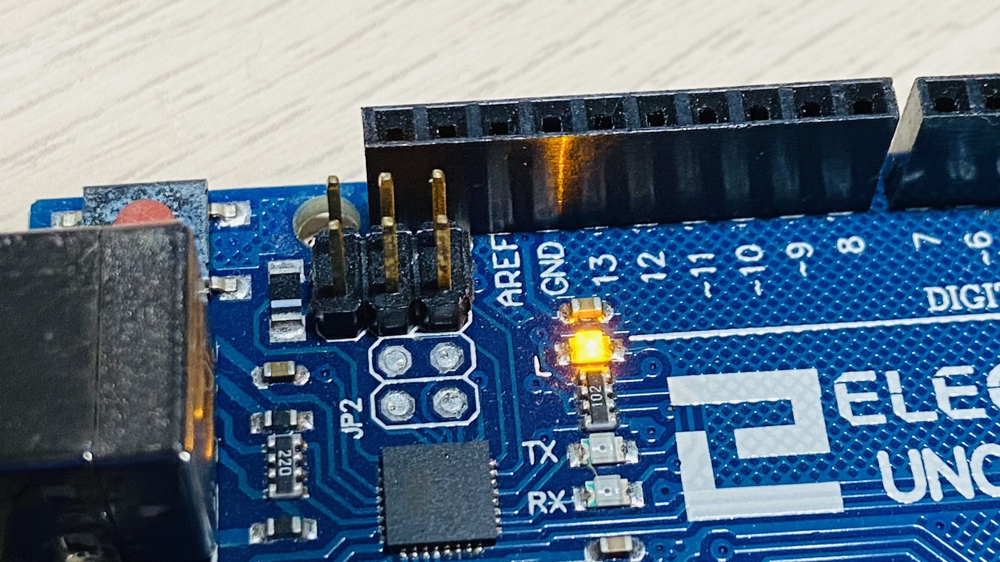

# arduino-morse-transmitter

## Introduction
An Arduino sketch to transmit a message in Morse code via a blinking LED. Upon completion, the sequence will loop back to the first character after a short pause.

## Configuration
| Variable | Description |
| - | - |
| `unit` | Determines the speed of Morse transmission. Denotes the length of a Morse code dot in milliseconds. |
| `message` | The string of characters to transmit. |

## Setup & Run
Upload the sketch to an Arduino Uno (or similar unit) and run to see the Morse code message played back.
